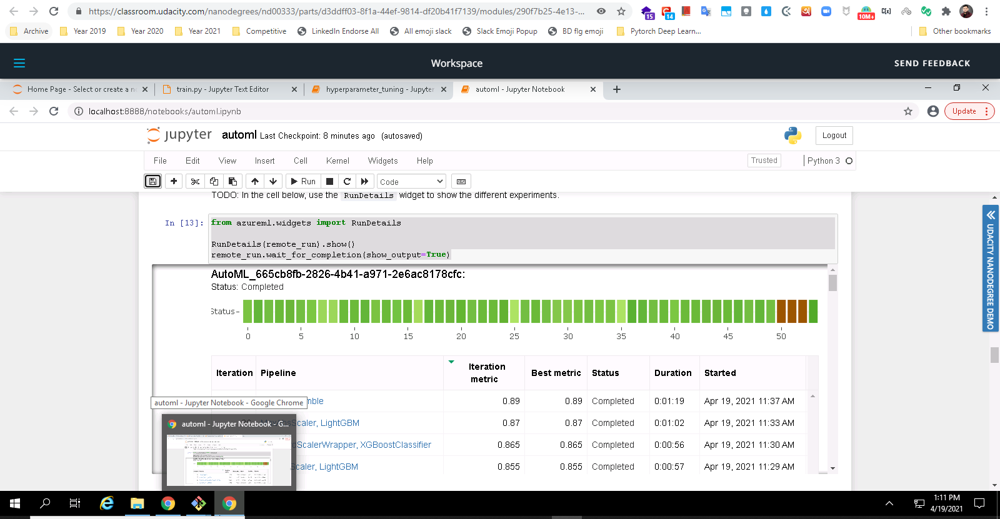
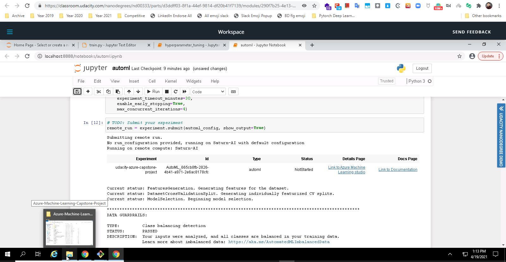
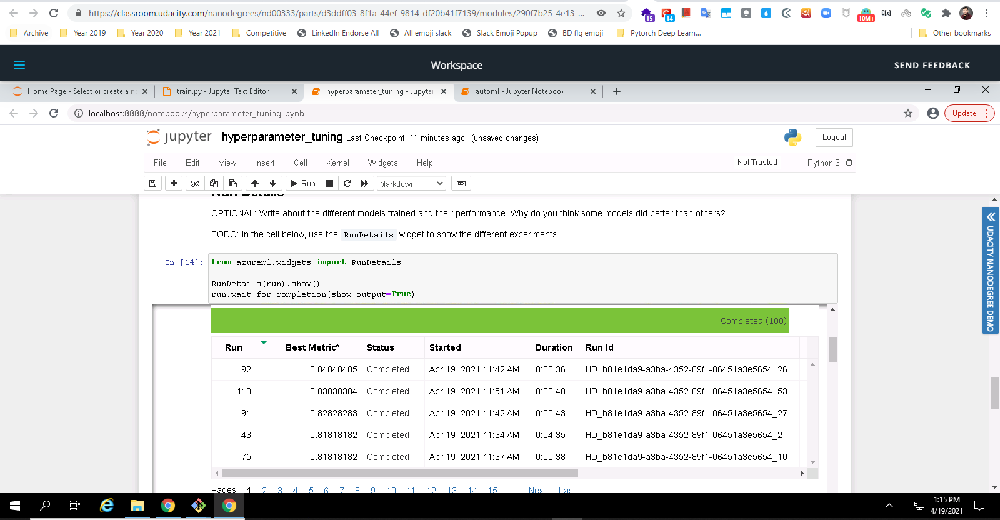
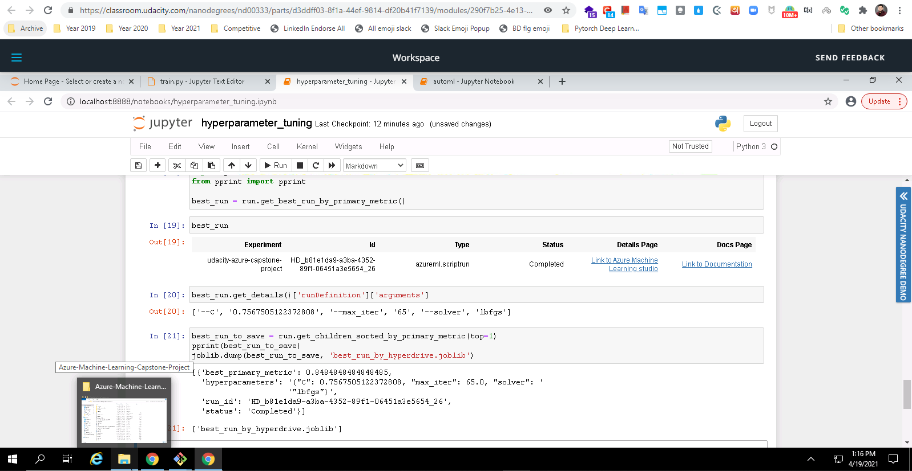
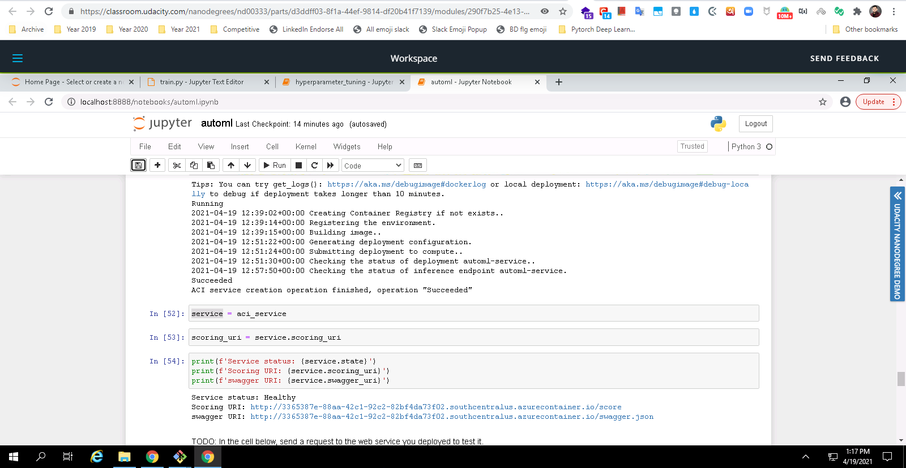
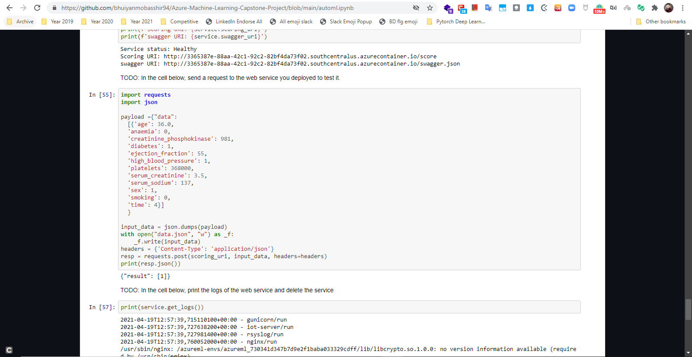

# Azure Machine Learning Capstone Project

In this project, my purpose was to create two models: one using Automated ML and one customized model (Logistic Regression) whose hyperparameters are tuned using HyperDrive. I compared the performance of both the models and deployed the best performing model which is actually `AutoML` one.

This project demonstrated my ability to use an external dataset in the workspace, train a model using the different tools available in the AzureML framework as well as my ability to deploy the model as a web service.

## Project Set Up and Installation

I settled up Microsfot VM and initiated a computing instance to run jupyter notebook on that. There was 4 cores, 14 gb RAM and instance name was STANDARD_D2_V2. Then I used AZUREML python sdk to work wiht this project.

## Dataset

### Overview

In this prooject I am using heart failure clinical records dataset from UCI machine learning repository which follow ups death events based on 12 clinical features.
UCI ML Repository for this dataset is - [link](https://archive.ics.uci.edu/ml/machine-learning-databases/00519/heart_failure_clinical_records_dataset.csv)

### Task

Using 12 clinicla features I am going to follow up death events with this dataset

### Access

I am accessing this using `Dataset.Tabular` class and `from_delimited_files()` function

## Automated ML

This is basically the automl settings and configurations I used 

```
automl_config = AutoMLConfig(
    compute_target=compute_cluster,
    task="classification",
    training_data=train,
    label_column_name="DEATH_EVENT",
    primary_metric="accuracy",
    n_cross_validations=5,
    experiment_timeout_minutes=30,
    enable_early_stopping=True,
    max_concurrent_iterations=4)
```
where `primary_metric`, `n_cross_validations`, `experiment_timeout_minutes`, `enable_early_stopping`, `max_concurrent_iterations` were configuration settings

### Results

Result from AutoML was impressive, here I am adding those

```
{'AUC_micro': 0.9184999999999999,
 'precision_score_macro': 0.8920874584874939,
 'average_precision_score_micro': 0.9187092096434253,
 'f1_score_macro': 0.8736199353413496,
 'average_precision_score_weighted': 0.9192310678704205,
 'log_loss': 0.3772695009957162,
 'balanced_accuracy': 0.8672161172161171,
 'matthews_correlation': 0.7578833083374518,
 'accuracy': 0.89,
 'AUC_macro': 0.9082264957264957,
 'AUC_weighted': 0.9082264957264957,
 'f1_score_weighted': 0.8891644340994013,
 'norm_macro_recall': 0.7344322344322344,
 'recall_score_weighted': 0.89,
 'f1_score_micro': 0.89,
 'recall_score_macro': 0.8672161172161171,
 'average_precision_score_macro': 0.9020510767382299,
 'recall_score_micro': 0.89,
 'weighted_accuracy': 0.9077487037523717,
 'precision_score_weighted': 0.8979478414615991,
 'precision_score_micro': 0.89,
 'accuracy_table': 'aml://artifactId/ExperimentRun/dcid.AutoML_665cb8fb-2826-4b41-a971-2e6ac8178cfc_53/accuracy_table',
 'confusion_matrix': 'aml://artifactId/ExperimentRun/dcid.AutoML_665cb8fb-2826-4b41-a971-2e6ac8178cfc_53/confusion_matrix'}
```
Accuracy score was `.89` that's why I deployed this one over hyperdrive one. Accuracy was my primary metric.

Improvement could be done with data imbalance issue, data imputation issue.




## Hyperparameter Tuning

I choosed `Logistic Regression` for this experiment where my hyperparameter sampling was this 

```
param_sampling = RandomParameterSampling({'C': uniform(0, 20),
                                        'max_iter' : quniform(10, 250, 1),
                                        'solver' : choice('liblinear','sag','lbfgs', 'saga')})
```
after the model went for `max_total_runs=100 and max_concurrent_runs=4` but the accuracy was less then the automl one.

### Results

I got the accuracy of `.84` with this model where best hyperparameter tuning was 

```
['--C', '0.7567505122372808', '--max_iter', '65', '--solver', 'lbfgs']
``` 
and overall best was for this model

```
[{'best_primary_metric': 0.8484848484848485,
  'hyperparameters': '{"C": 0.7567505122372808, "max_iter": 65.0, "solver": '
                     '"lbfgs"}',
  'run_id': 'HD_b81e1da9-a3ba-4352-89f1-06451a3e5654_26',
  'status': 'Completed'}]
```
As this model didn't do well with primary metric I didn't deploy this.


*TODO* Remeber to provide screenshots of the `RunDetails` widget as well as a screenshot of the best model trained with it's parameters.




## Model Deployment

I deployed the automl one with `ACIWebService` and with the scoring URI and I made request to the endpoint. Here is the active endpoint - 



I made the request to scoring uri and got json response back as prediction. With this image you will have better demonstration



## Screen Recording
*TODO* Provide a link to a screen recording of the project in action. Remember that the screencast should demonstrate:
- A working model
- Demo of the deployed  model
- Demo of a sample request sent to the endpoint and its response

## Standout Suggestions
*TODO (Optional):* This is where you can provide information about any standout suggestions that you have attempted.
